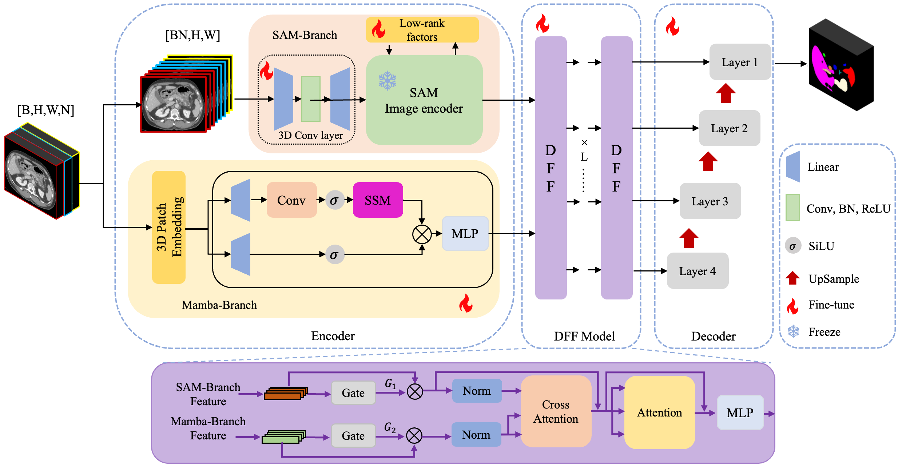

# VSS-SAM++: Visual State Space-Aware SAM for 3D Medical Image Segmentation

<p align="center">
  
</p>

VSS-SAM++ is a PyTorch-based framework for 3D medical image segmentation that combines the strong visual priors of the Segment Anything Model (SAM) with the long-range dependency modeling ability of Vision Mamba. The proposed dual-branch architecture uses a SAM branch to extract high-level semantic representations and a Mamba branch to capture cross-slice 3D contextual information, followed by a gated deep feature fusion module to adaptively integrate complementary features. Extensive experiments on nine public CT and MRI datasets demonstrate that VSS-SAM++ achieves superior segmentation performance over representative CNN-based, Transformer-based, Mamba-based, and SAM-based methods.

## Usage

### Environmental Requirements

* Ubuntu 20.04
* Anaconda
* Python 3.10.19
* PyTorch 2.2.0
* CUDA 11.8

### Installation

Clone this repository and install the dependencies.

```bash
git clone https://github.com/Lv-hub172/VSS-SAMpp.git
cd VSS-SAMpp

conda create -n vsssampp python=3.10.19
conda activate vsssampp

conda install pytorch==2.2.0 torchvision torchaudio pytorch-cuda=11.8 -c pytorch -c nvidia

pip install -r requirements.txt
```

## Training

Before training, please download the SAM pre-trained model weights and save them under the `checkpoints/` folder.

Recommended checkpoint:

* [SAM ViT-L](https://dl.fbaipublicfiles.com/segment_anything/sam_vit_l_0b3195.pth)

Then start training with:

```bash
python train.py \
    --root_path /path/to/your/data \
    --output /path/to/your/output \
    --ckpt ./checkpoints/sam_vit_l_0b3195.pth
```

## Acknowledgments

Our code is based on [MA-SAM](https://github.com/cchen-cc/MA-SAM/tree/main), [SAMed](https://github.com/hitachinsk/SAMed), [FacT](https://github.com/JieShibo/PETL-ViT/tree/main/FacT), and [Segment Anything](https://github.com/facebookresearch/segment-anything). We appreciate the authors for their great works.
